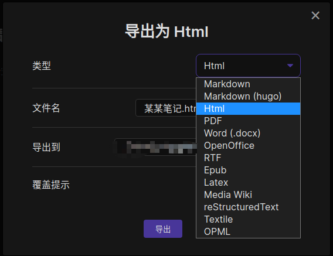
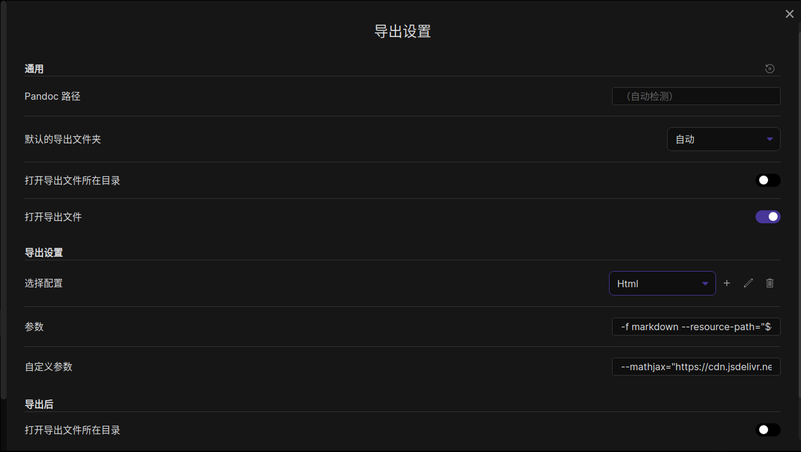

# Obsidian Enhancing Export Plugin

[English](./README.md) | 中文

这是一个基于 Pandoc 的 Obsidian 加强版导出插件。提供了基本的导出格式：Markdown 、Markdown（Hugo [https://gohugo.io/](https://gohugo.io/)）、Html、docx、Latex等。
其中 Markdown 、Markdown（Hugo）、Html 会把媒体资源一并导出。

**注意：**目前自用的就是 Markdown 、Markdown（Hugo）、Html，在 Mac OS、Windows、Linux 可正常使用，其他未经严格测试。

## 界面截图
- 导出界面，在文件菜单上点击 `导出为......`
  
- 设置界面
  

## 安装
1. 需要先安装 `pandoc`，最好配置到 PATH 环境变量，或者设置界面指定路径。
   参考地址：[https://pandoc.org/installing.html](https://pandoc.org/installing.html)
2. 在 Obsidian 插件市场，搜索 `obsidian-enhancing-export` 进行安装。

## 自定义命令

本插件是支持自定义导出命令的，在设置界面，点击添加按钮，选择 `Custom` 作为模板，即可新增一个自定义导出的配置了。

### 变量
你可以使用 `${variable}` 在自定义导出的命令中。它们的值是：

| 变量名 | 值 |
| -- | -- |
| `${outputPath}` |导出路径，例如，你的导出位置是：`/User/aaa/Documents/test.pdf` ，则 `${outputDir}` 会替换为那个路径。|
| `${outputDir}` | 导出目录，按上面的例子，它会被替换为 `/User/aaa/Documents`。 |
| `${outputFileName}` | 没有扩展名的文件名，按上面的例子，它会被替换为 `test`。 |
| `${outputFileFullName}` | 文件的全名，按上面的例子，它会被替换为 `test.pdf`。 |
| `${currentPath}` | 当前文件路径，例如当前的文件位置是 `/User/aaa/Documents/readme.md`，那么它会被替换为这个文件的位置。 |
| `${currentDir}` | 当前文件所在目录，按上面的例子，值为  `/User/aaa/Documents`。 |
| `${currentFileName}` | 当前文件不带扩展名的名字，值是 `readme` |
| `${currentFileFullName}` | 当前文件全名，值是 `readme.md`。 |

## 最后

- 欢迎提供更多命令模板。
- 有问题可以提交 Issue 给我。
